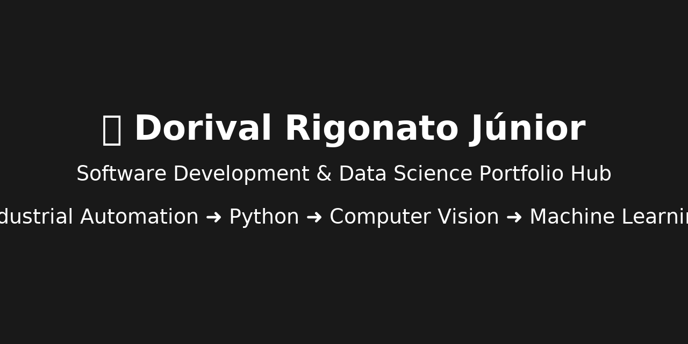

  

# 🌎 README – Português | English | Español  

🔽 Escolha seu idioma / Choose your language / Elige tu idioma:

- 🇧🇷 [Português](#🇧🇷-português)
- 🇺🇸 [English](#🇺🇸-english)
- 🇪🇸 [Español](#🇪🇸-español)

---

# 🇧🇷 Português

<h1 align="center">👋 Olá, eu sou Dorival Rigonato Júnior</h1>
<h3 align="center">Desenvolvimento de Software · Ciência de Dados · Visão Computacional</h3>

Sou engenheiro em transição para a área de tecnologia, depois de muitos anos atuando com:

- Programação avançada de CLPs (PLC)
- Automação industrial e controle de processos
- Liderança técnica e integração de sistemas em campo
- Treinamento técnico (software + hardware)
- Troubleshooting e diagnóstico em operação real

Essa experiência construiu uma base sólida de lógica, pensamento algorítmico e solução prática de problemas — habilidades que transferi naturalmente para Python, Ciência de Dados e Engenharia de Software.

### 🚀 Atualmente estudando:
- Machine Learning (Scikit-learn)
- Visão Computacional (OpenCV e YOLO)
- Python para análise e engenharia de dados
- Desenvolvimento de APIs com FastAPI
- Projetos de dados end-to-end

### 📂 Meu Portfólio:
Veja meus projetos principais neste repositório:  
👉 **https://github.com/dorigonato**

---

# 🇺🇸 English

<h1 align="center">👋 Hi, I'm Dorival Rigonato Júnior</h1>
<h3 align="center">Software Development · Data Science · Computer Vision</h3>

I am an engineer transitioning into the technology field after many years working with:

- Advanced PLC programming  
- Industrial automation and process control  
- Technical leadership and field commissioning  
- Hardware/software integration  
- Troubleshooting and real-world diagnostics  
- Teaching automation systems  

This background gave me strong logic, structured problem-solving and system architecture thinking — skills that translated naturally into Python, Data Science and Software Engineering.

### 🚀 Currently learning:
- Machine Learning (Scikit-learn)
- Computer Vision (OpenCV & YOLO)
- Python for Data Engineering
- FastAPI
- End-to-end Data Science projects

### 📂 Portfolio:
Explore my main projects here:  
👉 **https://github.com/dorigonato**

---

# 🇪🇸 Español

<h1 align="center">👋 Hola, soy Dorival Rigonato Júnior</h1>
<h3 align="center">Desarrollo de Software · Ciencia de Datos · Visión por Computador</h3>

Soy un ingeniero en transición hacia la tecnología, después de muchos años trabajando con:

- Programación avanzada de PLC  
- Automatización industrial y control de procesos  
- Liderazgo técnico y puesta en marcha en campo  
- Integración de hardware y software  
- Diagnóstico y resolución de problemas reales  
- Capacitación técnica  

Esta experiencia me dio una base sólida en lógica, pensamiento algorítmico y resolución práctica de problemas, habilidades que migraron naturalmente a Python, Ciencia de Datos y Desarrollo de Software.

### 🚀 Actualmente estudiando:
- Machine Learning (Scikit-learn)
- Visión por Computador (OpenCV y YOLO)
- Python para análisis y ingeniería de datos
- FastAPI
- Proyectos de Ciencia de Datos end-to-end

### 📂 Portafolio:
Consulta mis proyectos principales aquí:  
👉 **https://github.com/dorigonato**

---

### 🤝 Conecte-se / Connect / Conecta  
- **LinkedIn:** www.linkedin.com/in/dorivalrigonato  
- **GitHub:** https://github.com/dorigonato  

---

✨ *Cada projeto representa um passo real na minha transição para tecnologia.*  
✨ *Every project is a real step in my transition to tech.*  
✨ *Cada proyecto es un paso real en mi transición a tecnología.*  
